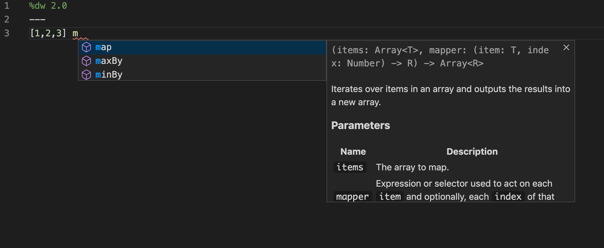
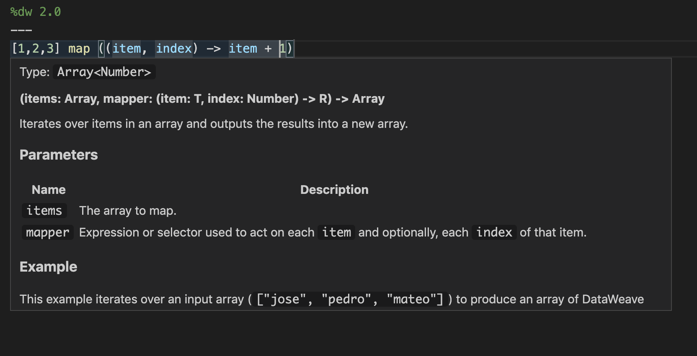
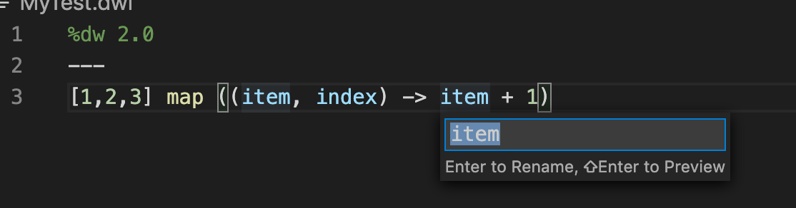

# DataWeave Extension Support

This extension adds basic support for editing DataWeave scripts. 
This is still in Alpha stage.  

## Features

The following table shows the status of various features.

| Feature               | Status | Notes                                                                                            |
| --------------------- | :----: | ------------------------------------------------------------------------------------------------ |
| Validation            |   ✅   | Syntax errors as you type and type errors on file save.                                          |
| Completions           |   ✅   |                                                                                                  |
| Hover (type at point) |   ✅   |                                                                                                  |
| Goto definition        |   ✅   | Works only on local project files                                   |
| Document symbols      |   ✅   |                                                                                                  |
| Formatting            |   ✅   |                                                                                  |
| Find references       |   ✅   |  Works only on local file                                                                                                |
| Highlight             |   ✅   |                                                                                                  |
| Rename symbol         |   ✅   |     Works only on local file                                                                                             |
| BAT Run Tests         |   ✅   |                                                                                             |

## Requirements

**Java 8 or 11 provided**

This extension is build on a Mac and we haven't yet tested on Windows or Linux

## Screenshots

### Completion

### Hover

### Rename
 

  

