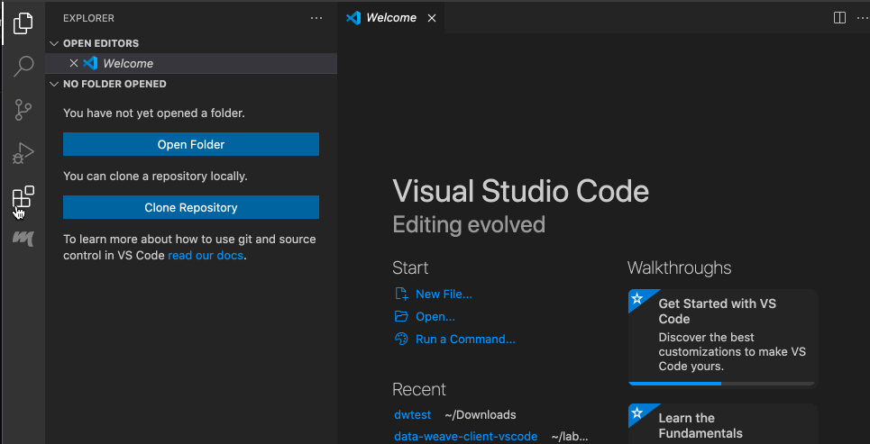
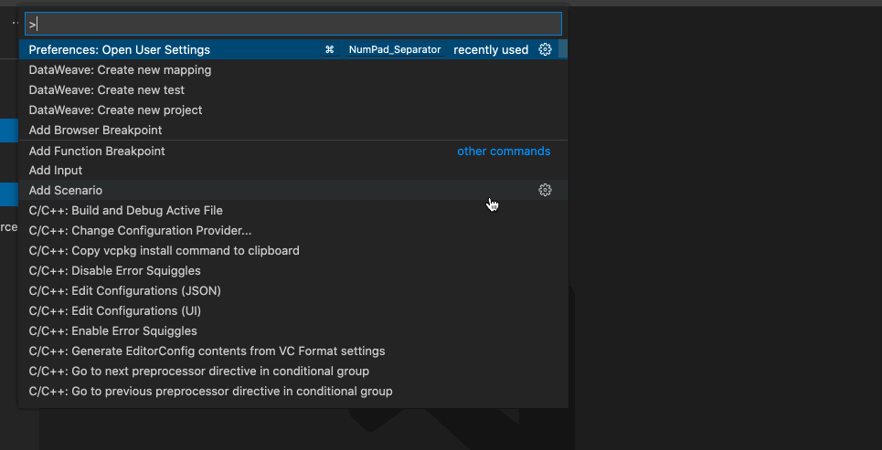
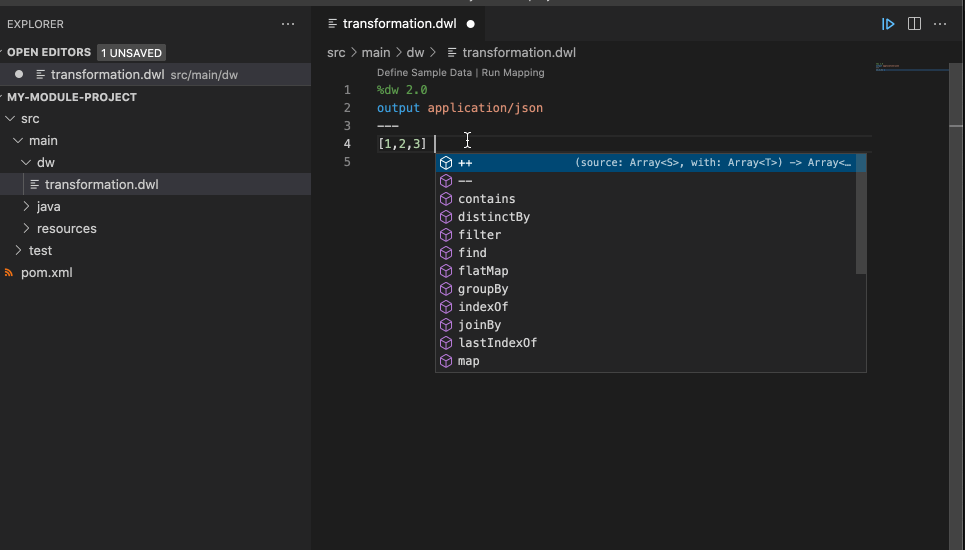
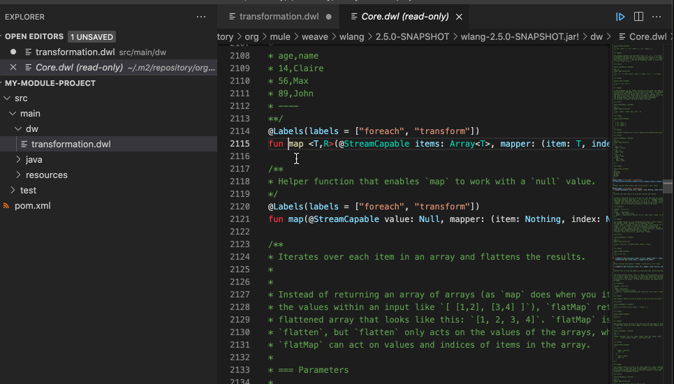
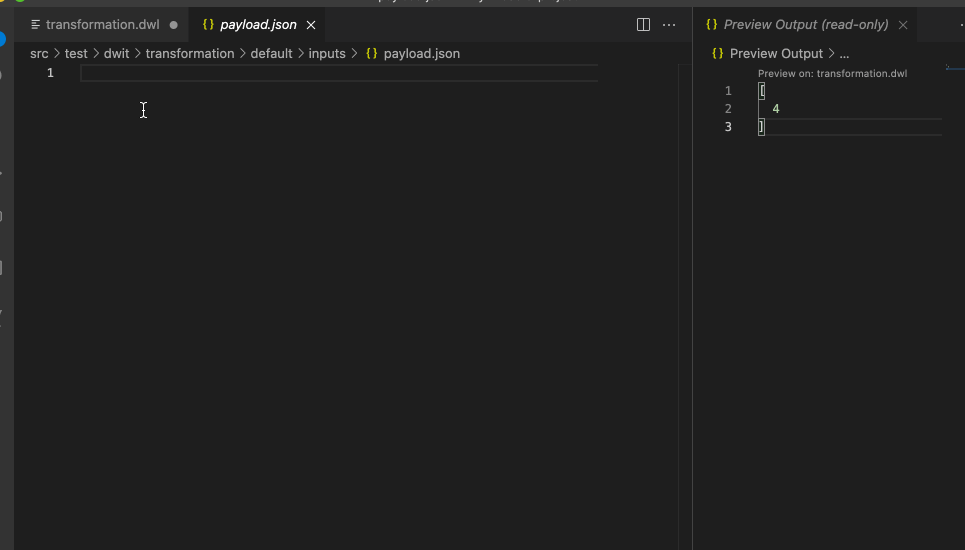
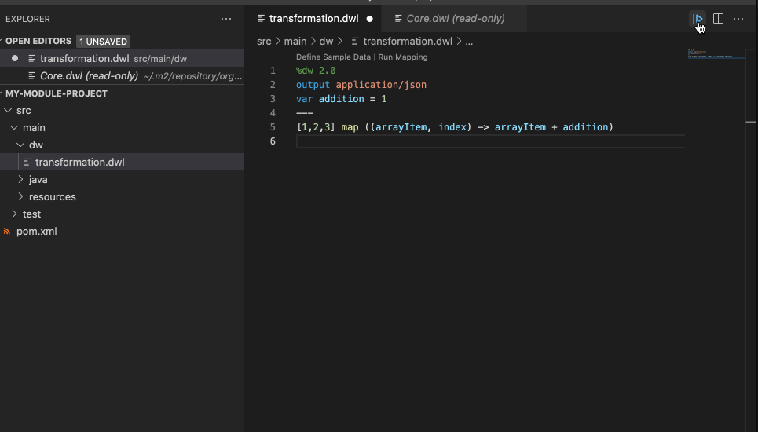
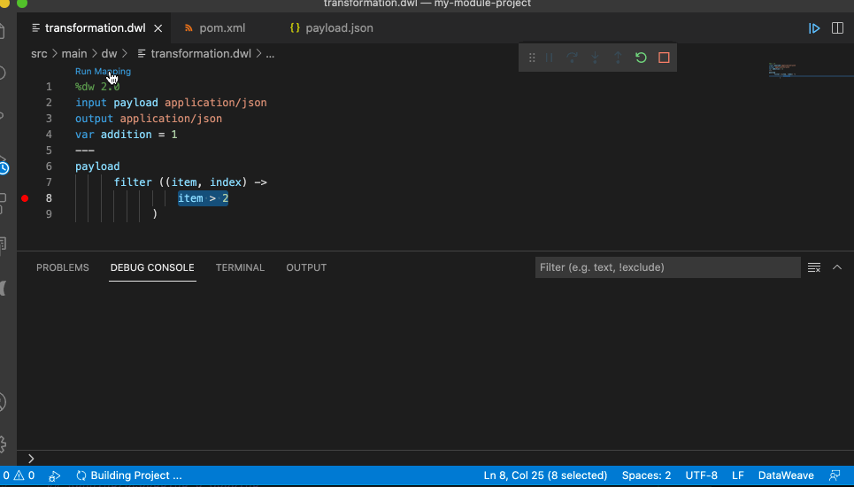

# DataWeave Plugin

This doc will show basic how to use the plugin

## Installing the plugin

Please Install The **DataWeave 2.0** Plugin develop by the **DataWeave Team**



## Create a New Weave Project

To create a new DW Project

* Launch de `Command Pallet` _**<ctrl> + P**_
* Select `DataWeave: Create new Project`
* Fill the **GroupId** for the new Project
* Fill the **ArtifactId** for the new Project
* Fill the **Version** for the new Project

Once the process has finished It will ask the user if the project wants to be open in a new window or not



## Project structure

DataWeave projects uses Maven to build and declare their dependencies.

```
├── pom.xml
├── src
│   ├── main
│   │   ├── dw
│   │   │   ├── MyMapping.dwl //Put your Weave File here
│   │   ├── java
│   │   │   └── MyUtils.java //Java Files If any goes here
│   │   └── resources
│   └── test
│       ├── dwit
│       │   └── MyMapping
│       │       └── default
│       │           └── inputs
│       │               └── payload.json //Sample data for your mappnigs goes here
│       ├── dwmit
│       ├── dwtest
│       │   └── Test.dwl //Unit Tests goes here
│       ├── java
│       └── resources
 
```

## Language Edition Features 

### Completion

Completion is provided for any visible functions, variables, types etc. It also
suggests fields based on the type inference



### Navigation

User can navigate to any definition local or from any imported library



### Addition Code editing features

* Find all References
* Refactors (local and cross files)
* Quick Fixes:
  * Auto Import when a function is present in a Module
  * Create a function/variable/type when is not found
* Outline
* Show parameters information
* Hover information with documentation

## Sample Data

Sample Data is a key part of a DW project development. It is going to be used to run your scripts and also for suggestions.

To Specify Sample Data, just click on the Code Lense _Specify Sample Data_  



## Preview/ Live Preview

Once sample data is set a user can have live feedback on how the script is working. There are two ways. 
One is to trigger it by hand when the user wants to execute it, or can enable AutoPreview by right clicking
on the editor. 




## Running/Debugging a Mapping

In order to run a Mapping the fastest way is to use the Code Lense _Run Mapping_ that should appear in the top of your DW script.

This is going to guide through all the things that are needed. The user can set breakpoints to stop evaluate expressions 
and all the debugging capabilities that VSCode provides.



## Weave Dependencies

This view shows all the dependencies resolved for this project.

